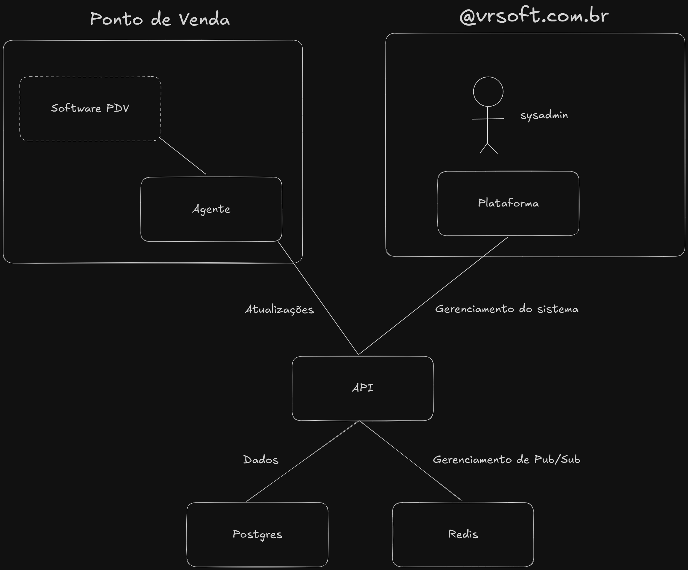

# Arquitetura do Sistema

Segue uma visão geral da arquitetura do sistema, incluindo os principais 
componentes e suas interações.

Explicação dos componentes:

- Ponto de Venda (PDV)
	- Tem o Software PDV (aquele usado no caixa da loja).
	- Esse software se conecta a um Agente, que é um "intermediário" responsável por conversar com o resto do sistema.

- Plataforma
	- É usada por um sysadmin (administrador de sistema),
	- O sysadmin controla e gerencia o sistema através dessa Plataforma.

- API
	- É a "ponte" que conecta tudo.
	- O Agente do PDV e a Plataforma se comunicam com a API.
	- A API manda atualizações para o PDV (via WebSocket) e recebe comandos de gerenciamento da plataforma.

- Bancos de dados
	- Postgres → Armazena os dados (informações do sistema).
	- Redis → Faz o gerenciamento de mensagens (Pub/Sub), que é uma forma rápida de enviar notificações ou sincronizar informações em tempo real.