# Como iniciar o projeto

O projeto utiliza Docker para facilitar o processo de configuração e
inicialização dos serviços necessários.

## Passos iniciais

Inicie o servidor backend com o Docker Compose:

```bash
cd docker
docker-compose up -d
```

Isso iniciará os seguintes serviços:
- API do VRDeploy (porta 3000)
- PostgreSQL (porta 5432)
- Redis (porta 6379)
- MinIO (porta 9000)
- MinIO Console (porta 9001)
- Plataforma web do VRDeploy (porta 4200)


Agora você pode acessar a plataforma web em `http://localhost:4200` com o
usuário `root_user@vrsoft.com.br` e senha `root_password`.

## Agente

Não é recomendado rodar o agente no Docker, pois ele precisa de acesso ao
sistema de arquivos. Para rodar o agente, você pode compilar o código ou
baixar um [binário pré-compilado na seção de releases do GitHub](https://github.com/matheuslanduci/vrdeploy/releases/tag/1.0.0).

```bash
cd ../agent
go build -o vrdeploy-agent .
```

E então rodar o agente com o comando:

```bash
./vrdeploy-agent setup
```

Isso iniciará o agente em modo de configuração, permitindo que você o
registre na plataforma web acessando `http://localhost:4200/agentes`. Após o
registro, você pode iniciar o agente normalmente com:

```bash
./vrdeploy-agent start
```

## Vinculação do agente com o PDV

Para vincular o agente com o PDV, siga os passos abaixo:

1. Acesse a plataforma web em `http://localhost:4200/agentes`

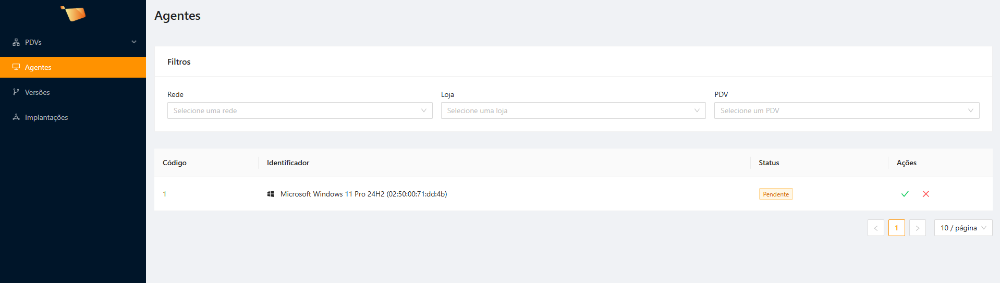

2. Clique em "Vincular" no agente que você deseja vincular.

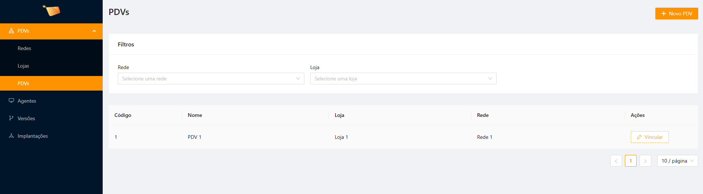

3. O agente agora está vinculado ao PDV e pronto para uso.

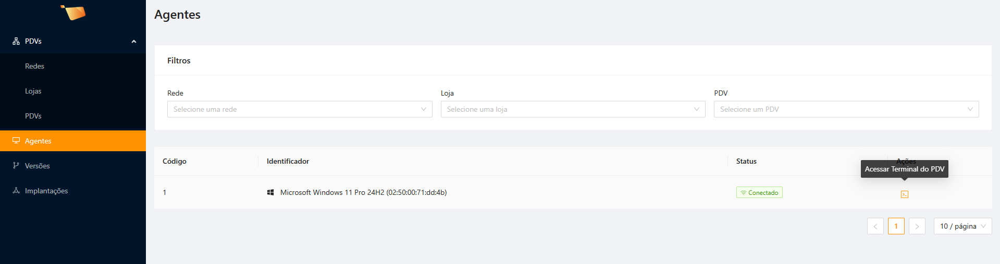

4. Você pode utilizar o terminal através da plataforma para acessar o PDV
   remotamente (após utilizar os comandos `./vrdeploy-agent setup`
   e `./vrdeploy-agent start` no PDV).

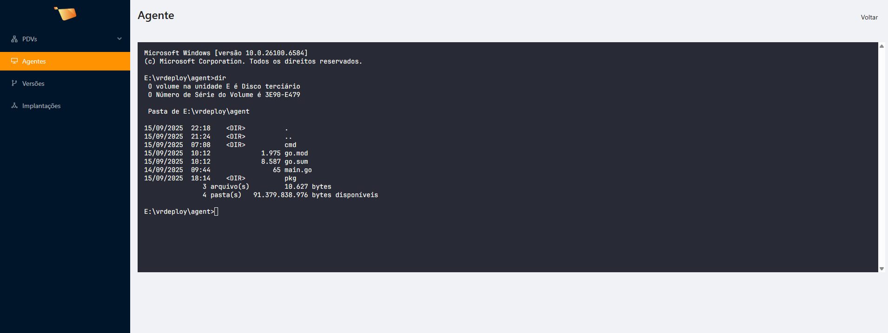


## Implantação de versão

Para implantar uma nova versão do software no PDV, siga os passos abaixo:

1. Acesse a plataforma web em `http://localhost:4200/versoes`

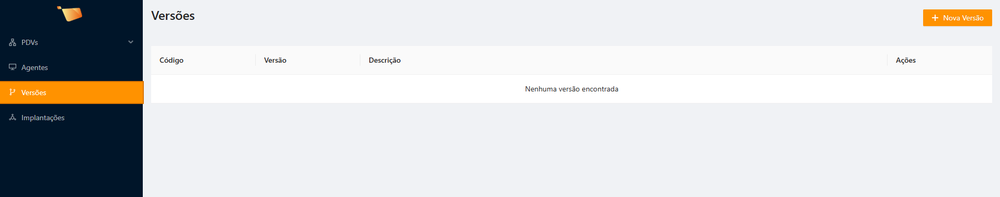

2. Clique em "Criar Versão" e preencha os detalhes da nova versão.

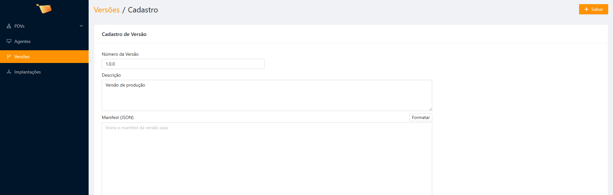

3. Preencha o campo "Manifesto". Ele segue o formato JSON, por exemplo:
   ```json
   {
     "version": "1.0.0",
     "dependencies": [
        {
          // Caminho do arquivo no .zip depois de extraído
          "path": "/example.exe", 
          "ready": {
            // Expressão para verificar se o processo está pronto
            "type": "grep",
            "expr": "hello world" 
          },
          "dependencies": [
            // você pode listar de forma recursiva, inclusive usar scripts                  
          ]
        }
     ]
   }
   ```

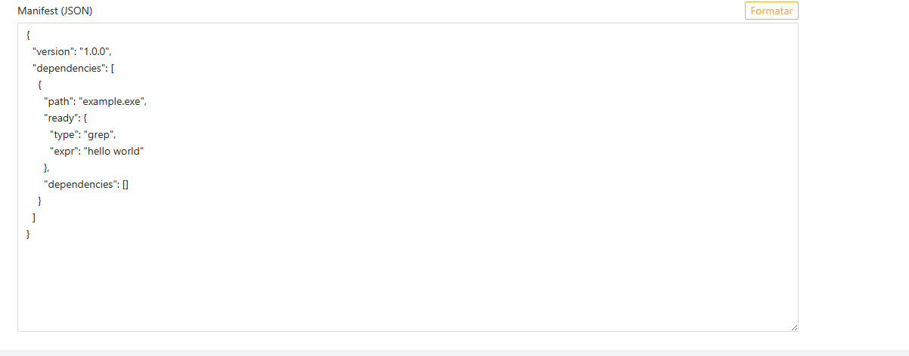

4. Salve a versão.

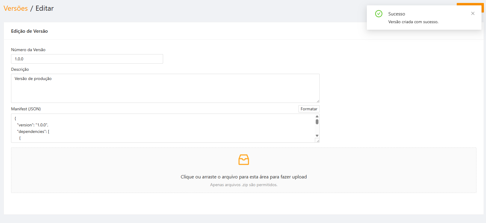

5. Faça o upload do arquivo .zip contendo os arquivos da nova versão
  (só é possível fazer upload de arquivos depois de criar a versão).

  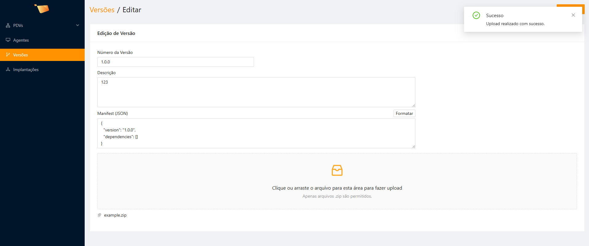

6. Volte para a tela de versões e clique em "Implantar" na versão que você
   acabou de criar.

   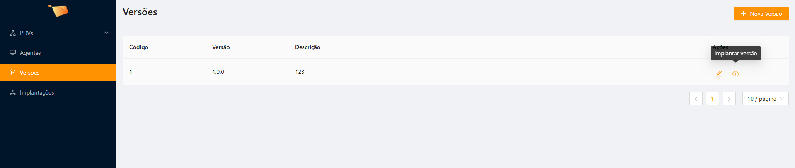

7. Selecione os PDV onde você deseja implantar a nova versão e clique em
   "Implantar".

   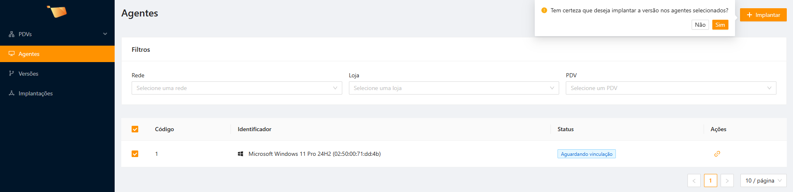

8. A implantação será iniciada e você poderá acompanhar o progresso na
   plataforma web.

   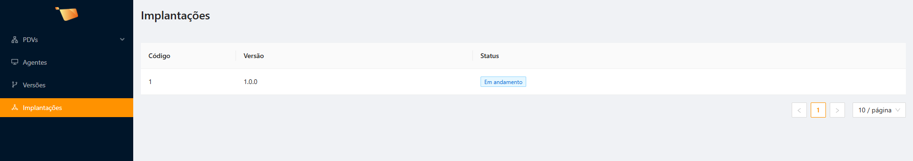